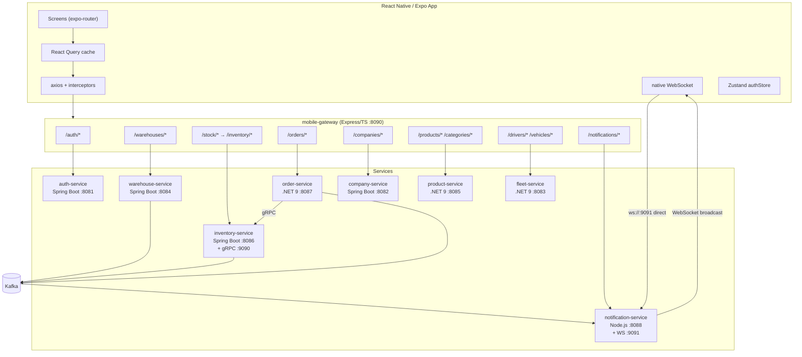

# Architecture Overview — Pocket Logistics Pro (Mobile)

## System Diagram



> **Note:** The mobile-gateway does **not** proxy WebSocket upgrades. Mobile connects
> directly to `ws://host:9091` for real-time events.

---

## Tech Stack (Mobile App)

| Layer | Choice | Reason |
|-------|--------|--------|
| Runtime | Expo SDK 51 + React Native | Cross-platform iOS/Android, OTA updates |
| Navigation | expo-router (file-based) | Type-safe routes, tab/stack nesting |
| State (auth) | Zustand | Lightweight, persisted with AsyncStorage |
| Server state | TanStack React Query v5 | Cache, background refetch, offline reads |
| HTTP | axios + interceptor | Attach Bearer token, handle 401 |
| Forms | react-hook-form + zod | Typed validation, consistent error UX |
| Styling | NativeWind (Tailwind for RN) | Rapid, consistent UI |
| Icons | @expo/vector-icons | No extra native setup |
| Camera/Scanner | expo-camera + expo-barcode-scanner | Permission flow, barcode decoding |
| Notifications | expo-notifications | Push token registration |
| WebSocket | native `WebSocket` API | Built in to RN, no extra dep |
| JWT decode | jwt-decode | Parse claims without verification (gateway validates) |
| TypeScript | strict mode | Matches backend type contracts |

---

## Target Folder Structure

```
pocket-logistics-pro-expo/
├── app/                        # expo-router screens and layouts
│   ├── (auth)/                 # login + register screens (no tab bar)
│   │   ├── login.tsx
│   │   └── register.tsx
│   ├── (tabs)/                 # main tab shell
│   │   ├── _layout.tsx         # 5-tab navigator
│   │   ├── index.tsx           # Tab 1: Domov (Dashboard)
│   │   ├── stock/              # Tab 2: Zaloga (Inventory)
│   │   │   ├── index.tsx       # Stock list
│   │   │   └── [warehouseId].tsx
│   │   ├── orders/             # Tab 3: Naročila
│   │   │   ├── index.tsx
│   │   │   └── create.tsx
│   │   ├── notifications.tsx   # Tab 4: Obvestila
│   │   └── more/               # Tab 5: Več (Products, Warehouses, Fleet, etc.)
│   │       ├── index.tsx
│   │       ├── products/
│   │       ├── warehouses/
│   │       ├── fleet/
│   │       ├── companies/
│   │       ├── ai.tsx
│   │       └── profile.tsx
│   └── _layout.tsx             # root layout (auth guard)
├── lib/
│   ├── api/                    # one file per domain entity
│   │   ├── auth.ts
│   │   ├── inventory.ts
│   │   ├── orders.ts
│   │   ├── warehouses.ts
│   │   ├── products.ts
│   │   ├── companies.ts
│   │   ├── fleet.ts
│   │   └── notifications.ts
│   ├── http/
│   │   ├── client.ts           # axios instance + interceptors
│   │   └── errors.ts           # formatApiError helper
│   ├── realtime/
│   │   └── wsClient.ts         # WebSocket wrapper (shell if WS not wired)
│   ├── scanner/
│   │   └── useBarcode.ts       # expo-camera permission + scan hook
│   └── ai/
│       └── aiClient.ts         # AI endpoint client (shell)
├── stores/
│   └── authStore.ts            # Zustand: token, user, role, actions
├── hooks/
│   ├── useRole.ts              # returns highest-privilege role
│   ├── useHasFeature.ts        # role→feature gate
│   └── realtime/
│       └── useNotifications.ts # polling or WS-based notification hook
├── components/
│   ├── RoleGate.tsx            # renders children only if role allowed
│   └── ui/                     # design system primitives
├── constants/
│   ├── roles.ts                # Role enum + feature-flag matrix
│   ├── i18n.ts                 # Slovenian user-visible strings
│   └── queryKeys.ts            # React Query key factory
├── types/
│   └── api.ts                  # DTOs mirroring backend response shapes
├── docs/                       # architecture documentation (this folder)
└── __tests__/                  # Jest unit tests
```

---

## Data Flow: Representative Read — List Stock by Warehouse

```
StockScreen
  → useQuery(['stock', warehouseId], () => inventoryApi.getByWarehouse(warehouseId))
  → lib/api/inventory.ts: axiosClient.get(`/stock/${warehouseId}`)
  → lib/http/client.ts: adds Authorization: Bearer <token>
  → mobile-gateway :8090/stock/:warehouseId
  → pathRewrite: /stock → /inventory
  → inventory-service :8086/inventory/:warehouseId
  → GetInventoryByWarehouseQueryHandler (CQRS query side)
  → JpaInventoryRepository
  → PostgreSQL inventory-db
  → List<InventoryResponse> { id, productId, warehouseId, quantity }
  → React Query caches result → StockScreen renders list
```

**Offline behaviour:** React Query's `staleTime` / `cacheTime` serve cached data when the
network is unavailable. All mutations require online (no offline write queue in this pass).

---

## Data Flow: Representative Write — Add Stock (with Optimistic Update)

```
AddStockForm.onSubmit({ warehouseId, productId, quantity })
  → useMutation(inventoryApi.addStock)
  → onMutate: queryClient.setQueryData(['stock', warehouseId], optimisticList)
  → axiosClient.post('/stock', body)
  → mobile-gateway: POST /stock → /inventory (pathRewrite)
  → inventory-service: AddStockCommandHandler (CQRS command side)
  → InventoryRepositoryPort.save()
  → Kafka: inventory.stock.updated event
  → Response: InventoryResponse
  → onSuccess: queryClient.invalidateQueries(['stock'])   ← replaces optimistic data
  → onError: queryClient.setQueryData(['stock', warehouseId], previousList)
```

---

## Auth Flow

```
1. LOGIN
   User enters email + password
   → POST /auth/login (no Authorization header)
   → mobile-gateway strips Set-Cookie, forwards JSON body and X-Auth-Token header
   → authStore.setAuth({ token, user: { id, email, name, role } })
   → token persisted in SecureStore (expo-secure-store)
   → jwt-decode extracts role claim → authStore.role = 'MANAGER' | 'WORKER'

2. EVERY REQUEST
   axiosClient interceptor:
     request: config.headers['Authorization'] = `Bearer ${authStore.token}`
     response 401: clear authStore → redirect to /login
       (no refresh available; user must re-login — see ARCHITECTURE_GAPS.md Gap 1)

3. ROLE GATE
   useHasFeature('MANAGE_PRODUCTS') → constants/roles.ts matrix → boolean
   <RoleGate feature="MANAGE_PRODUCTS"> ... </RoleGate>

4. LOGOUT
   POST /auth/logout (best-effort, server clears cookie in web clients)
   → authStore.clear()
   → SecureStore.delete(TOKEN_KEY)
   → navigate to /(auth)/login
```
